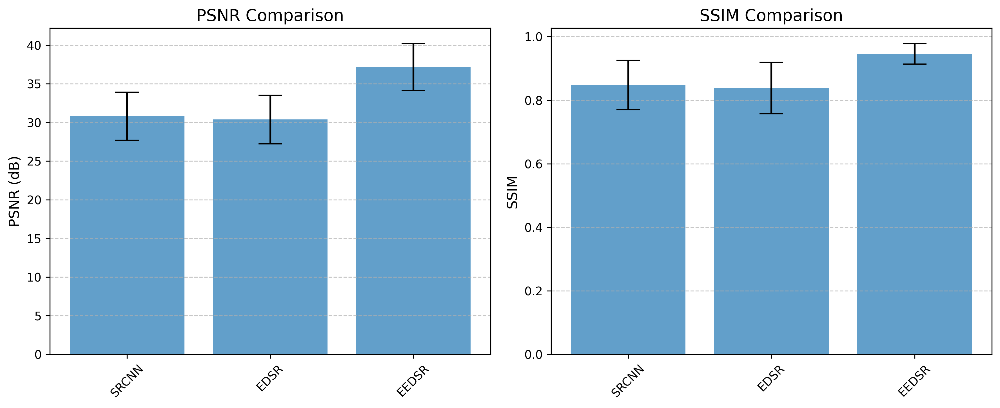
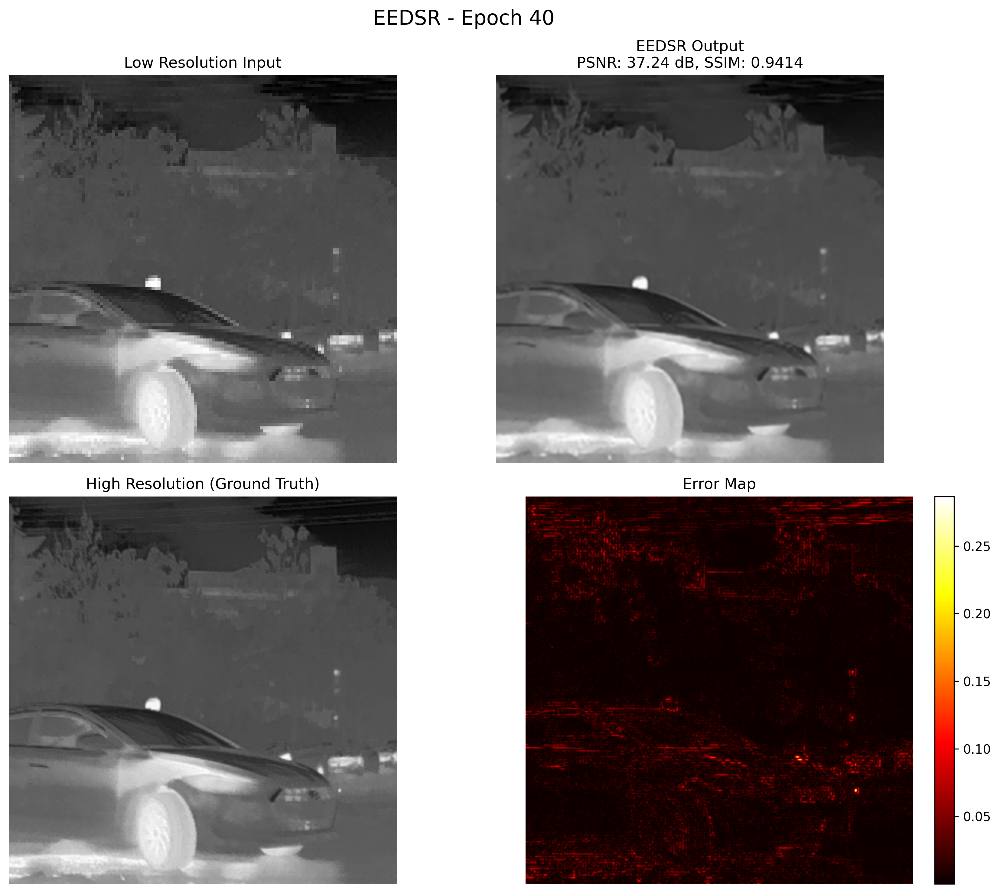
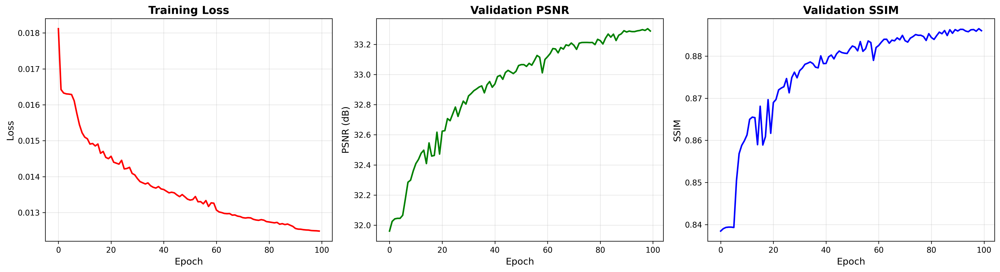

# Edge-Enhanced Deep Super-Resolution for Thermal Imagery (EEDSR)

**Hifssa Aslam, Meili Wang, Muhammad Rizwan, Hongwei Dong, Junhang Ge**

📄 [Read the full paper](https://doi.org/10.1145/3779232.3779455) — Published at VRCAI '25 (ACM SIGGRAPH International Conference on Virtual Reality Continuum and its Applications in Industry), Macau, China, December 2025.

---

## Abstract

Infrared imagery is crucial for surveillance, object detection, and autonomous navigation applications. However, the inherent low resolution of IR sensors limits the extraction of fine-grained details necessary for downstream tasks. Previous super-resolution approaches have predominantly optimized performance for IR single-image super-resolution; however, existing methods overlook spatial error analysis and real-world validation. This work presents an **Edge-Enhanced Deep Super-Resolution Network (EEDSR)** specifically designed for IR images by integrating a three-component loss function: pixel-wise L1 loss, edge-preserving loss, and perceptual loss. EEDSR is tailored to ensure color fidelity, sharp edge reconstruction, and perceptually realistic outputs. Experiments on benchmark datasets and real-world captured IR images demonstrate significant improvements over existing methods, achieving a **PSNR of 30.47** and an **SSIM of 0.8810** on real-world data, with comprehensive error map analysis highlighting superior structural preservation and reduced spatial artifacts.

---

## Key Results

### Model Comparison — SRCNN vs EDSR vs EEDSR (M3FD Benchmark)


### EEDSR Reconstruction Quality


### Real-World Thermal Camera Validation (CONOTECH Aquila)


### Training Convergence


---

## Results Summary

| Dataset | Model | PSNR (dB) | SSIM |
|---|---|---|---|
| M3FD (Vehicle) | SRCNN | 32.81 | 0.8606 |
| M3FD (Vehicle) | EDSR | 32.29 | 0.8529 |
| M3FD (Vehicle) | SwinIR | 30.89 | 0.9314 |
| M3FD (Vehicle) | **EEDSR (Ours)** | **37.37** | **0.9413** |
| M3FD (Pedestrian) | SRCNN | 27.68 | 0.7649 |
| M3FD (Pedestrian) | EDSR | 27.36 | 0.7582 |
| M3FD (Pedestrian) | SwinIR | 30.89 | 0.9314 |
| M3FD (Pedestrian) | **EEDSR (Ours)** | **34.24** | **0.9252** |
| Real-World | SwinIR | 25.60 | 0.7670 |
| Real-World | **EEDSR (Ours)** | **30.47** | **0.8810** |

---

## Repository Structure

```
EEDSR-thermal-project/
├── paper/              # Full paper PDF
├── src/
│   ├── baseline/        # SRCNN / EDSR training
│   ├── eedsr/            # EEDSR training (M3FD + own dataset)
│   ├── swinir/           # SwinIR baseline training
│   ├── hat/              # HAT baseline training
│   └── analysis/         # Model comparison & evaluation scripts
├── results/             # Metrics, error maps, comparison figures
└── assets/              # README showcase images
```

## Citation

If you use this work, please cite:

```bibtex
@inproceedings{aslam2025eedsr,
  title     = {Edge-Enhanced Deep Super-Resolution for Thermal Imagery},
  author    = {Aslam, Hifssa and Wang, Meili and Rizwan, Muhammad and Dong, Hongwei and Ge, Junhang},
  booktitle = {Proceedings of the 20th ACM SIGGRAPH International Conference on Virtual Reality Continuum and its Applications in Industry (VRCAI '25)},
  year      = {2025},
  pages     = {1--6},
  publisher = {ACM},
  address   = {New York, NY, USA},
  doi       = {10.1145/3779232.3779455}
}
```

## Acknowledgments

This work was supported by the College of Information Engineering, Northwest A&F University (NWAFU), Yangling, China.
